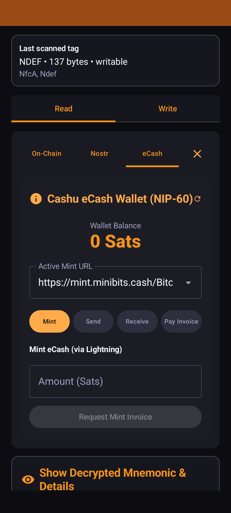
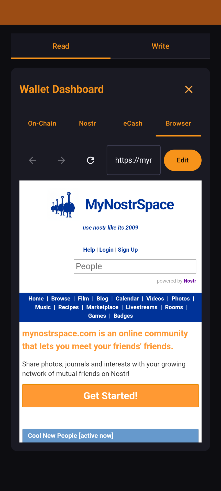

# NFCommunicator

**NFCommunicator is an Android application that serves as an offline cryptographic identity wallet.** It uses inexpensive, physical NFC cards as encrypted portable storage for Bitcoin wallet seeds, Nostr identities, Cashu credentials, and secure messages. 

---

## Why NFCommunicator?

*   **Offline Secrets Storage**: Unlike hardware wallets that require USB/Bluetooth or password managers relying on cloud sync, NFCommunicator stores your secrets on physical, offline NFC cards.
*   **Why NFC Cards?**: NFC cards cost only a few dollars, require no batteries, are easy to duplicate for backup purposes, and can be securely stored in multiple physical locations.
*   **Zero Local Footprint**: Your seed phrase never permanently resides on your phone's storage. It is only decrypted in memory when you tap your card and enter your password, then wiped immediately upon closing.
*   **Secondary Wallet / Decoy Payload**: Configure optional encrypted secondary payloads protected by separate passwords. These payloads can contain independent single-signature wallets, messages, or decoy data while remaining cryptographically separate from the primary vault.
*   **Fault-Tolerant Backups**: Distribute your keys across multiple cards using Shamir's Secret Sharing (SSS) to create robust `k-of-n` backups (e.g., needing any 2 out of 3 tags to reconstruct your wallet).
*   **Privacy by Default**: Modern SegWit/Taproot address rotation and Silent Payments reduce address reuse and improve receiver privacy.

---

## Comparison Matrix

| Feature / Property | NFCommunicator | Typical Hardware Wallet | Standard Software Wallet |
| :--- | :---: | :---: | :---: |
| **Self-Custody (User owns keys)** | ✅ | ✅ | ✅ |
| **BIP-39 Mnemonic Standard** | ✅ | ✅ | ✅ |
| **Local Transaction Signing** | ✅ | ✅ | ✅ |
| **SegWit / Taproot Support** | ✅ | ✅ | ✅ |
| **No Key Cloud Sync / Telemetry** | ✅ | ✅ | ❌ (many sync by default) |
| **Offline Secret Security** | ✅ (NFC Card) | ✅ (Secure Element) | ❌ (Device Storage) |
| **Zero Local Key Storage Footprint** | ✅ (Wiped in RAM) | ✅ (Wiped in RAM) | ❌ (Saved in Keystore/DB) |
| **In-App Nostr Web Browser (NIP-07)** | ✅ | ❌ | Rare |
| **Nostr Signer (NIP-55)** | ✅ | Rare | Some |
| **Cashu eCash (NIP-60)** | ✅ | Rare | Some |
| **Silent Payments (BIP-352)** | 🚧 | Rare | Rare |
| **Shamir's Secret Sharing Backup** | ✅ | Some | Rare |
| **Secondary Wallet / Decoy Payload** | ✅ | Rare | ❌ |
| **Hardware Unit Cost** | $1 - $20 | $60 - $200 | $0 |

---

## Architecture & Key Derivation

```
            Encrypted NFC Card
                   │
       Password + PBKDF2 (2,000,000)
                   │
           AES-256-GCM Decryption
                   │
              Decrypted Payload
                   |
     ┌─────────────┴─────────────┐
     │                           │
Primary Vault Data          Secondary Payload
     │                           │
     BIP-39 Seed             Wallet / Message
     │
   ┌─┴─────────┬──────────┬───────────┐
   │           │          │           │
Bitcoin      Nostr       Cashu      Browser
BIP-84       NIP-06      NIP-60      NIP-07
Taproot      NIP-55
Silent Pay
```

---

## Security Model

*   **✓ Encrypted Card Storage**: Private keys are stored encrypted on the NFC card and only decrypted temporarily in volatile memory when unlocked.
*   **✓ Zero Logs**: Passwords and decryption pins are never written to permanent disk storage or system logs.
*   **✓ Volatile Memory Only**: Decrypted seeds, private keys, and Nostr keys exist strictly in volatile RAM.
*   **✓ Auto-Wiping**: Active wallet memory is immediately purged when the wallet is closed.
*   **✓ No Cloud Sync**: Complete absence of network backups, cloud synchronization, or remote telemetry.
*   **✓ Local Cryptography**: Private keys are decrypted and transactions are built/signed entirely on-device.
*   **✓ Auditable**: 100% open source, deterministic, and independently auditable build system.

---

## Screenshots

| Wallet Dashboard | NFC Scan Dialog | Read & Decrypt |
| :---: | :---: | :---: |
| [](docs/screenshots/wallet.png) | [](docs/screenshots/scan_dialog.png) | [](docs/screenshots/read.png) |

| Write & Backup | Nostr Signer Prompt | Coin Control | Browser |
| :---: | :---: | :---: | :---: |
| [](docs/screenshots/write.png) | [](docs/screenshots/nostr_signer.png) | [](docs/screenshots/ecash.png) | [](docs/screenshots/browser.png) |

---

## Installation

### Option A: Install via Release APK (Recommended)
1. Go to the [Releases](https://github.com/Mnpezz/NFCommunicator/releases) page of this repository on GitHub.
2. Download the latest compiled production APK.
3. Open the APK on your Android device and confirm installation (you may need to enable "Allow installation from unknown sources" in Android settings).

### Option B: Build from Source
If you prefer to compile and install the application yourself, proceed to the [Build Instructions](#build-instructions) section below.

---

## Key Features

### 🔒 NFC Storage & Security
*   **Hardened Key Derivation**: Uses AES-256-GCM with a high work factor of **2,000,000 PBKDF2-HMAC-SHA256 iterations** to resist offline GPU brute-force cracking. Fallback trial decryption at **600,000 iterations** preserves compatibility with older written tags.
*   **Volatile Memory Purging**: Plaintext password buffers are wiped from state on tab changes, scan cancellations, or wallet closure. All decrypted credentials (seeds, Nostr keys, etc.) are nulled when locking the wallet.
*   **"Forget Card" Option**: Instantly purges the cached encrypted NDEF payload from volatile memory to reset the screen to a fresh scan state without restarting the app.
*   **Shamir's Secret Sharing (SSS) Backup**: Securely split your BIP-39 mnemonic seed phrase across multiple physical tags with configurable thresholds (e.g. 3 SSS shares with a 2-share threshold).
    *   **Under the Hood**: A single BIP-39 mnemonic seed phrase (the root secret) is mathematically split into $N$ unique physical shares (e.g., written to 3 separate NFC cards/rings).
    *   **Unlocking**: You scan any $K$ cards (e.g., 2 of the 3 cards) and enter their passwords. The app reconstructs the original seed phrase in volatile memory to derive a standard Taproot/SegWit single-signature private key.
    *   **On-Chain Footprint**: Transactions look exactly like standard, cheap single-signature transactions.
    *   **Compatibility**: You don't need to coordinate/save XPUBs (public keys) or back up complex descriptor files like you do in a traditional multisig setup. If the app is unavailable, the underlying SSS shares can be recovered using compatible offline recovery tooling.
    *   **Vault + Secondary Wallet Design**: Each NFC share can optionally contain an encrypted secondary single-signature wallet alongside its SSS vault share. This wallet can be used for everyday spending, emergency access, or a decoy wallet depending on the user's needs. The high-value vault remains protected by Shamir Secret Sharing and requires the configured quorum of shares.
    

#### SSS Multi-Share Vault (2-of-3) Example

| Card | Share | Password | Secondary Wallet | Wallet Password |
| :--- | :--- | :---: | :--- | :---: |
| **Card 1** | 🔑 Share 1 | `123` | 🪙 Secondary Wallet A | `aaa` |
| **Card 2** | 🔑 Share 2 | `456` | 🪙 Secondary Wallet B | `bbb` |
| **Card 3** | 🔑 Share 3 | `789` | 🪙 Secondary Wallet C | `ccc` |

> [!NOTE]
> **Vault Reconstruction**: Scan any 2 of the 3 cards and enter their passwords to reconstruct the primary seed in volatile memory.
> **Secondary Wallets**: Each secondary wallet is independently encrypted and can be unlocked using only that card and its unique secondary password.


*   **Dual-Layer Card Security**: Each NFC card can contain multiple encrypted payloads, each protected by its own password. The vault share and secondary wallet operate independently, allowing different security policies for recovery, daily use, and emergency access.
*   **Secondary Wallet / Decoy Payload**: Write an alternative secondary wallet mnemonic or message mapped to a secondary password. Entering the secondary password decrypts this secondary payload instead of your primary wallet keys.


### 🧡 On-Chain Bitcoin Wallet
*   **Modern Defaults**: Prioritizes **Native SegWit (BIP-84)** and **Taproot (BIP-86)** address formats at the top of the interface.
*   **Silent Payments (BIP-352)**: Automatically derives Silent Payment Scan (`m/352'/0'/0'/1'/0`) and Spend (`m/352'/0'/0'/0'/0`) private keys from mnemonics to display your `sp1...` address. Hides balance/UTXO panels and provides a warning banner advising the use of a dedicated scanner (like Cake Wallet or Sparrow Wallet) to scan/spend incoming stealth funds.
*   **Silent Payments Sending**: Full support for spending coin-controlled inputs to pay external BIP-352 stealth addresses.
*   **HD Address Rotation**: Automatically scans a 10-address index window (0 to 9) to fetch balances and UTXOs in parallel, presenting a fresh receiving address to prevent address reuse.
*   **Granular Coin Control**: Inspect your UTXOs with detailed derivation indices and select exactly which inputs to sign.
*   **Camera-based QR Scanner**: Easily scan recipient addresses and transaction details.

### 💜 Nostr Signer & In-App Browser
*   **Hardened In-App Nostr Browser**: Features a built-in browser (defaulting to `mynostrspace.com`) that automatically injects NIP-07 script APIs (`window.nostr`) to log into any web-based Nostr client (like Primal, Iris, Coracle, Snort, or Nostrudel) securely.
    *   **Zero-Permission Sandbox**: Operates entirely within a zero-permission network profile. It requests no location, camera, or personal device permissions to protect your physical privacy.
    *   **Anti-Fingerprinting**: Improves compatibility with websites that reject embedded WebViews by presenting a standard mobile Chrome user agent.
    *   **Double-Isolated Sessions**: The browser session and active page persist smoothly while you navigate other wallet tabs (checking eCash balances or scanning QR codes), but everything is completely and aggressively purged on startup and wallet closure to prevent persistent web tracking.
*   **On-Screen Approval Prompts**: Confirms event signing and NIP-04/NIP-44 encryption/decryption requests via native popup dialogs, keeping the private key safely hidden from the website code.
*   **NIP-55 Nostr Signer Service**: Operates as an external background service allowing other native Android apps (Amethyst, Wisp, etc.) to request public keys, sign events, or perform encryption/decryption.
*   **Package Allowlisting**: Validates the calling package name. Prevents automated calls from unapproved apps and stores authorized package credentials in a persistent allowlist.
*   **Auto-Approval Rules**: Set customizable event permissions to automatically sign specific event types (e.g. kind 5, 22242, 10050, 31234) and NIP-04/NIP-44 actions.
*   **Switch Account UX**: Change active profiles or scan a new NFC tag directly from the signer request prompt.

### 🪙 eCash (Cashu NIP-60/61)
*   **Mint Management**: Mint, melt (pay Lightning invoices), send, and receive Cashu tokens directly.
*   **Mint Discovery**: In-app search of active public Cashu mints to easily swap and select mint endpoints.

---

## Tag Support

This app utilizes standard NDEF APIs for maximum compatibility (e.g., NTAG series, MIFARE Ultralight, etc.), but prefers raw `MifareClassic` direct storage on handsets and tags that support it.
*   **Raw MIFARE Classic**: contiguously stores the encrypted message, skipping manufacturer sector 0 and sector trailer ACL blocks.
*   **NDEF Reader Mode Flags**: Configured to capture NDEF-formatable tags automatically for seamless initial formatting.

---

## UX Flow

### 1. Locked State & Read Screen
*   **Passive Scan**: Hold any compatible tag to the back of the phone. The app immediately reads and caches the raw encrypted payload in memory.
*   **Decrypt**: Enter the password and tap **Try Password**. A full-screen dialog overlay with a radar pulse animation appears during key derivation, unlocking the wallet.
*   **Forget**: If a card is cached but you wish to clear it from memory, tap the red **Forget Card** button next to the password input.

### 2. Wallet Dashboard (Unlocked State)
*   Provides On-chain, Nostr, eCash, and Browser tabs.
*   Displays modern SegWit/Taproot receiving addresses, total balance, coin control UTXOs, and the transaction sending form.
*   *Note:* Hides the Coin Control panel for Nostr Taproot, and hides both On-chain Balance and Coin Control panels for Silent Payments (replaced with the setup warning card).

### 3. Write Screen
*   Select your backup type (Single NFC or SSS Split), enter your desired password, write your mnemonic draft, and click **Write to Card**. 
*   Hold your tag against the phone; a persistent full-screen animation overlay tracks the writing process, closing automatically upon success.

---

## Build Instructions

1.  Ensure `ANDROID_HOME` points to your Android SDK.
2.  Copy [keystore.properties.example](keystore.properties.example) to `~/.config/nfccommunicator/keystore.properties` and configure your key paths for signed builds.
3.  Run `./gradlew assembleDebug` for testing, or `./gradlew test` to execute the full unit and integration test suite.
