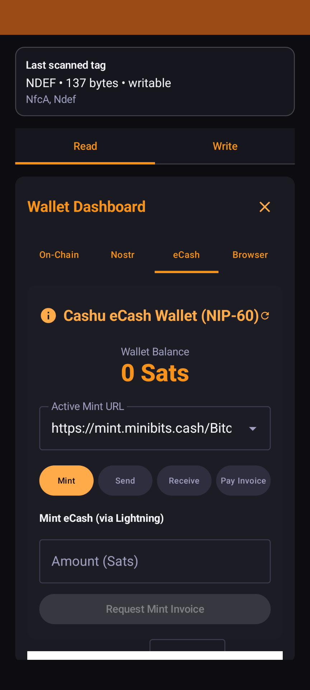
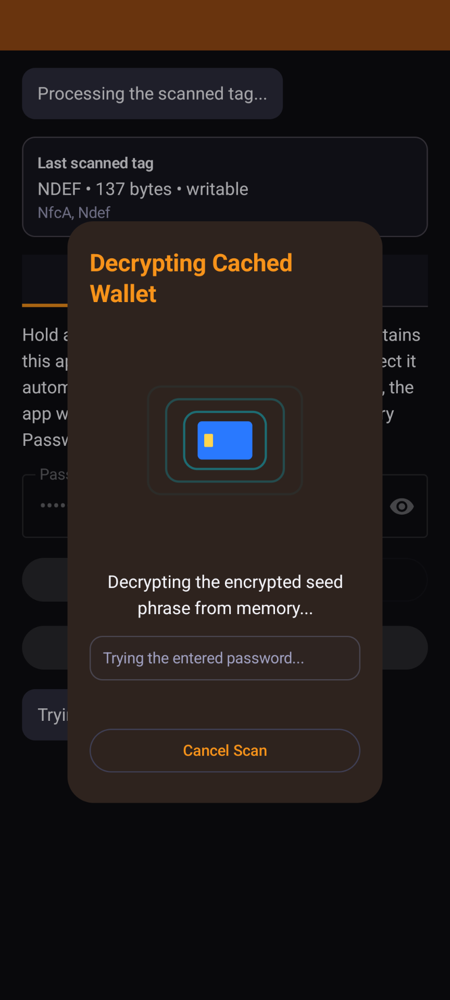
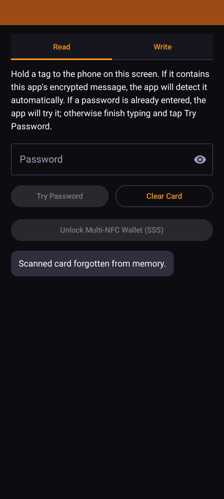
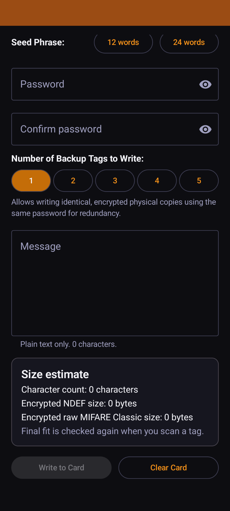
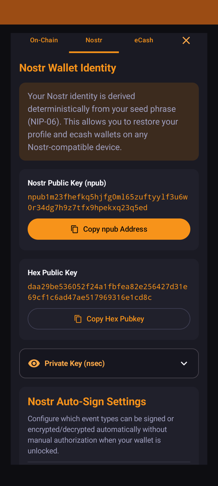

# NFCommunicator

**NFCommunicator is an offline cryptographic identity wallet that stores encrypted secrets on inexpensive NFC cards.** It securely manages Bitcoin wallet seeds, Nostr identities, Cashu credentials, and private messages without relying on cloud services or permanently storing secrets on your phone.  

---

## Why NFCommunicator?

*   **Offline Secrets Storage**: Unlike hardware wallets that require USB/Bluetooth or password managers relying on cloud sync, NFCommunicator stores your secrets on physical, offline NFC cards.
*   **Why NFC over a Hardware Wallet?**: NFC cards cost only a few dollars, require no batteries, are easy to duplicate for backup purposes, and can be securely stored in multiple physical locations.
*   **Zero Local Footprint**: Your seed phrase never permanently resides on your phone's storage. It is only decrypted in memory when you tap your card and enter your password, then wiped immediately upon closing.
*   **Duress Protection**: Configure a secondary emergency password that reveals an alternate encrypted payload (like a dummy seed or custom message) instead of your real wallet keys.
*   **Fault-Tolerant Backups**: Distribute your keys across multiple cards using Shamir's Secret Sharing (SSS) to create robust `k-of-n` backups (e.g., needing any 2 out of 3 tags to reconstruct your wallet).
*   **Privacy by Default**: Modern SegWit/Taproot address rotation and Silent Payments reduce address reuse and improve receiver privacy.

---

## Feature Comparison

| Feature | NFCommunicator | Typical Hardware Wallet | Standard Software Wallet |
| :--- | :---: | :---: | :---: |
| **Offline Secret Storage** | NFC Card | Secure Element | Device Storage |
| **Local Transaction Signing** | ✅ | ✅ | ✅ |
| **Nostr Signer (NIP-55)** | ✅ | Rare | Some |
| **Cashu** | ✅ | Rare | Some |
| **Silent Payments** | ✅ | Rare | Rare |
| **Shamir Backup** | ✅ | Some | Rare |

---

## Architecture & Key Derivation

```
            Encrypted NFC Card
                   │
       Password + PBKDF2 (2,000,000)
                   │
           AES-256-GCM Decryption
                   │
              BIP-39 Mnemonic
                   │
       ┌───────────┼───────────┐
       │           │           │
  Bitcoin      Nostr       Cashu
  BIP-84       NIP-06      NIP-60
  Taproot      NIP-55
  Silent Pay
```

---

## Security Model

*   **✓ Sealed Cards**: Private keys never leave the NFC card unencrypted.
*   **✓ Zero Logs**: Passwords and decryption pins are never written to permanent disk storage or system logs.
*   **✓ Volatile Memory Only**: Decrypted seeds, private keys, and Nostr keys exist strictly in volatile RAM.
*   **✓ Auto-Wiping**: Active wallet memory is immediately purged and garbage-collected when the wallet is closed.
*   **✓ No Cloud Sync**: Complete absence of network backups, cloud synchronization, or remote telemetry.
*   **✓ Local Cryptography**: Private keys are decrypted and transactions are built/signed entirely on-device.
*   **✓ Auditable**: 100% open source, deterministic, and independently auditable build system.

---

## Screenshots

| Wallet Dashboard | NFC Scan Dialog | Read & Decrypt |
| :---: | :---: | :---: |
| [](docs/screenshots/wallet.png) | [](docs/screenshots/scan_dialog.png) | [](docs/screenshots/read.png) |

| Write & Backup | Nostr Signer Prompt | Coin Control |
| :---: | :---: | :---: |
| [](docs/screenshots/write.png) | [](docs/screenshots/nostr_signer.png) | [](docs/screenshots/coin_control.png) |

---

## Installation

### Option A: Install via Release APK (Recommended)
1. Go to the [Releases](https://github.com/Mnpezz/NFCommunicator/releases) page of this repository on GitHub.
2. Download the latest compiled production APK.
3. Open the APK on your Android device and confirm installation (you may need to enable "Allow installation from unknown sources" in Android settings).

### Option B: Build from Source
If you prefer to compile and install the application yourself, proceed to the [Build Instructions](#build-instructions) section below.

---

## Key Features

### 🔒 NFC Storage & Security
*   **Hardened Key Derivation**: Uses AES-256-GCM with a high work factor of **2,000,000 PBKDF2-HMAC-SHA256 iterations** to resist offline GPU brute-force cracking. Fallback trial decryption at **600,000 iterations** preserves compatibility with older written tags.
*   **Volatile Memory Purging**: Plaintext password buffers are wiped from state on tab changes, scan cancellations, or wallet closure. All decrypted credentials (seeds, Nostr keys, etc.) are nulled when locking the wallet.
*   **"Forget Card" Option**: Instantly purges the cached encrypted NDEF payload from volatile memory to reset the screen to a fresh scan state without restarting the app.
*   **Shamir's Secret Sharing (SSS)**: Securely split your BIP-39 mnemonic seed phrase across multiple physical tags with configurable thresholds (e.g. 3 SSS shares with a 2-share threshold).
*   **Duress / Emergency Payload**: Write an alternative emergency message (e.g., dummy seed or custom notice) mapped to a secondary emergency password. Entering the emergency password decrypts the dummy payload instead of your real wallet.

### 🧡 On-Chain Bitcoin Wallet
*   **Modern Defaults**: Prioritizes **Native SegWit (BIP-84)** and **Taproot (BIP-86)** address formats at the top of the interface.
*   **Silent Payments (BIP-352)**: Automatically derives Silent Payment Scan (`m/352'/0'/0'/1'/0`) and Spend (`m/352'/0'/0'/0'/0`) private keys from mnemonics to display your `sp1...` address. Hides balance/UTXO panels and provides a warning banner advising the use of a dedicated scanner (like Cake Wallet or Sparrow Wallet) to scan/spend incoming stealth funds.
*   **Silent Payments Sending**: Full support for spending coin-controlled inputs to pay external BIP-352 stealth addresses.
*   **HD Address Rotation**: Automatically scans a 10-address index window (0 to 9) to fetch balances and UTXOs in parallel, presenting a fresh receiving address to prevent address reuse.
*   **Granular Coin Control**: Inspect your UTXOs with detailed derivation indices and select exactly which inputs to sign.
*   **Camera-based QR Scanner**: Easily scan recipient addresses and transaction details.

### 💜 Nostr Signer (NIP-55)
*   **Seamless Integration**: Operates as a background service allowing external Nostr clients (Amethyst, Wisp, etc.) to request public keys, sign events, or perform NIP-04/NIP-44 encryption/decryption.
*   **Package Allowlisting**: Validates the calling package name. Prevents automated calls from unapproved apps and stores authorized package credentials in a persistent allowlist.
*   **Auto-Approval Rules**: Set customizable event permissions to automatically sign specific event types (e.g. kind 5, 22242, 10050, 31234) and NIP-04/NIP-44 actions.
*   **Switch Account UX**: Change active profiles or scan a new NFC tag directly from the signer request prompt.

### 🪙 eCash (Cashu NIP-60/61)
*   **Mint Management**: Mint, melt (pay Lightning invoices), send, and receive Cashu tokens directly.
*   **Mint Discovery**: In-app search of active public Cashu mints to easily swap and select mint endpoints.

---

## Tag Support

This app utilizes standard NDEF APIs for maximum compatibility (e.g., NTAG series, MIFARE Ultralight, etc.), but prefers raw `MifareClassic` direct storage on handsets and tags that support it.
*   **Raw MIFARE Classic**: contiguously stores the encrypted message, skipping manufacturer sector 0 and sector trailer ACL blocks.
*   **NDEF Reader Mode Flags**: Configured to capture NDEF-formatable tags automatically for seamless initial formatting.

---

## UX Flow

### 1. Locked State & Read Screen
*   **Passive Scan**: Hold any compatible tag to the back of the phone. The app immediately reads and caches the raw encrypted payload in memory.
*   **Decrypt**: Enter the password and tap **Try Password**. A full-screen dialog overlay with a radar pulse animation appears during key derivation, unlocking the wallet.
*   **Forget**: If a card is cached but you wish to clear it from memory, tap the red **Forget Card** button next to the password input.

### 2. Wallet Dashboard (Unlocked State)
*   Provides On-chain, Nostr, and eCash tabs. 
*   Displays modern SegWit/Taproot receiving addresses, total balance, coin control UTXOs, and the transaction sending form.
*   *Note:* Hides the Coin Control panel for Nostr Taproot, and hides both On-chain Balance and Coin Control panels for Silent Payments (replaced with the setup warning card).

### 3. Write Screen
*   Select your backup type (Single NFC or SSS Split), enter your desired password, write your mnemonic draft, and click **Write to Card**. 
*   Hold your tag against the phone; a persistent full-screen animation overlay tracks the writing process, closing automatically upon success.

---

## Build Instructions

1.  Ensure `ANDROID_HOME` points to your Android SDK.
2.  Copy [keystore.properties.example](keystore.properties.example) to `~/.config/nfccommunicator/keystore.properties` and configure your key paths for signed builds.
3.  Run `./gradlew assembleDebug` for testing, or `./gradlew test` to execute the full unit and integration test suite.
